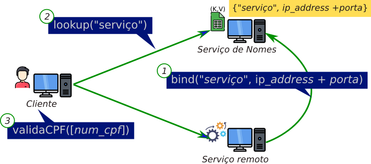

# Serviço de Nomes

**Universidade Federal de Alagoas - UFAL**

Aluno: José Ytalo Ramon de Almeida Gonçalves - 19111001

Disciplina: Sistema Distribuído (2021.2)

Professo: Tércio de Morais

Entrega: 10 de julho de 2022 às 23:59

 

## Descrição da Atividade

- O objetivo deste trabalho é construir um sistemas de nomes simples para dois serviços:
    1. Validação de CPF
    2. Cálculo do índice de massa corpórea (IMC) 
- A localização do serviço deverá ser transparente para o cliente
- O cliente deverá saber apenas o endereço e porta do serviço de nomes e o nome do serviço
- A figura em anexo mostra a sequência de eventos:
    1. Ao iniciar a aplicação servidora, esta deve se registrar no serviço de nomes (binding)​
    2. A aplicação cliente deverá solicitar ao serviço de nomes um dos dois serviços implementados (lookup), informando o seu nome
    3. Com a resposta do serviço de nomes, o cliente poderá executar a chamada remota do serviço.
- Trabalho em dupla

*Diagrama de fluxo do projeto*

## Instruções de Execução

1. [Servidor de Nome](./nameservice/)
   - *# python mainnameservice.py* 
2. [Servidor de Serviço (CPF)](./cpfservice/)
   - *# python maincpfservice.py*
3. [Servidor de Serviço (IMC)](./imcservice/)
   - *# python mainimcservice.py*
4. [Cliente (CPF)](./mainclientcpf.py)
   - *# python mainclientcpf.py*
5. [Cliente (IMC)](./mainclientimc.py)
   - *# python mainclientimc.py*

## Vídeo de Execução do Projeto

|        |
| :------------------------------------: |
| *Link: <https://youtu.be/7mfYC5fIoEo>* |
